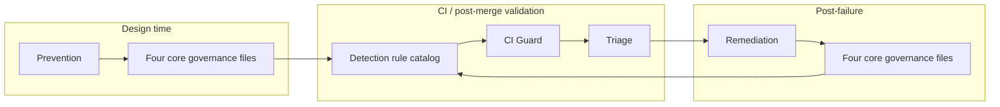

# Governance Drift Control Model

**Version:** 1.0.0  
**Status:** ACTIVE  
**Last Updated:** 1405/04/03 | 2026/06/24  
**Type:** Consolidation and consistency model (not a new layer, not enforcement)

This document provides a **single canonical mental model** of how all governance drift controls interact. It consolidates existing contracts; it does **not** introduce new rules, layers, authority types, or behavioral changes.

---

## 1. Purpose

The **Governance Drift Control Model** unifies five existing control planes into one lifecycle architecture:

```
Prevention → Detection → CI Guard → Triage → Remediation
```

Each plane has a distinct responsibility, defined in its own contract. This model:

- maps **responsibility boundaries** and **non-overlap guarantees**,
- defines **layer interaction invariants** and **data flow**,
- states **failure isolation** and **system integrity** rules,
- serves as the reference diagram for authors, reviewers, agents, and tooling implementers.

**Authoritative sources remain the individual contracts.** Where this model and a contract disagree, the contract wins.

| Plane | Authoritative document | Path |
| --- | --- | --- |
| Prevention | Governance Drift Prevention Contract | `.specify/governance/ci/governance-drift-prevention-contract.md` |
| Detection | Governance Consistency Test Spec | `.specify/governance/tests/governance-consistency-test-spec.md` |
| CI Guard | Governance Guard Layer Spec | `.specify/governance/ci/governance-guard-layer-spec.md` |
| Triage | Governance Drift Triage Spec | `.specify/governance/ci/governance-drift-triage-spec.md` |
| Remediation | Governance Drift Remediation Contract | `.specify/governance/ci/governance-drift-remediation-contract.md` |

**Normative governance sources (validated; not drift layers):**

| File | Role |
| --- | --- |
| `.specify/governance/_meta/authority-model.md` | Authority ontology |
| `.specify/governance/execution-policy.md` | HALT classification, nomination policy |
| `.specify/governance/governance-enforcer.md` | Runtime procedural enforcement |
| `.specify/docs/catalog-decisions.md` | Canonical authority ownership map |

---

## 2. Unified Architecture

### 2.1 Lifecycle overview



**Direction of control:** left-to-right for observation and repair; **no upward authority escalation**. Prevention and remediation touch governance file content; detection, guard, and triage are read-only on those files.

---

### 2.2 Stage: Prevention

| Attribute | Definition |
| --- | --- |
| **Contract** | `governance-drift-prevention-contract.md` v1.0.0 |
| **When** | Design time; PR review; governance change proposal draft |
| **Responsibility** | Constrain authoring so drift is not introduced at source |
| **Input** | Proposed edits to four core governance files; author/reviewer intent |
| **Output** | Process discipline (checklist sign-off); no machine artifact required |
| **Does not** | Run CI; detect drift; classify findings; fix files; enforce HALT |

**Non-overlap guarantee:** Prevention influences *quality of edits* only. It has **no channel** into CI pass/fail logic. A prevention sign-off does not waive or trigger guard failure.

---

### 2.3 Stage: Detection

| Attribute | Definition |
| --- | --- |
| **Contract** | `governance-consistency-test-spec.md` v1.0.0 |
| **When** | Invoked by CI Guard (automated) or manual/agent audit (read-only) |
| **Responsibility** | Define invariants (INV-*), tests (A–D), and drift rules (DRIFT-*) — *what constitutes drift* |
| **Input** | Read-only content of four core governance files |
| **Output** | Rule catalog semantics (not findings by itself); guard engine materializes findings |
| **Does not** | Assign root cause; classify drift type; pass/fail pipeline; remediate; prevent at authoring |

**Non-overlap guarantee:** Detection is a **specification of rules**, not an execution or interpretation layer. It does not assume why drift occurred — only that a rule condition holds.

---

### 2.4 Stage: CI Guard

| Attribute | Definition |
| --- | --- |
| **Contract** | `governance-guard-layer-spec.md` v1.0.0 |
| **When** | CI job `governance-guard` on configured triggers |
| **Responsibility** | Execute detection rules; emit structured findings; decide PASS / FAIL / WARN per HARD_GUARD_MODE |
| **Input** | Four core files; detection spec; env (`HARD_GUARD_MODE`, etc.) |
| **Output** | `governance-drift-report.json`; `governance-drift-summary.md`; pipeline outcome |
| **Does not** | Classify drift_type; recommend remediation category; modify governance files; prevent at design time |

**Non-overlap guarantee:** CI Guard **detects and gates** only. It does not perform triage classification (delegated downstream). Finding `severity` is assigned per guard spec — not redefined by triage or remediation.

---

### 2.5 Stage: Triage

| Attribute | Definition |
| --- | --- |
| **Contract** | `governance-drift-triage-spec.md` v1.0.0 |
| **When** | After guard emits `findings[]`; before or in parallel with human/CI consumption |
| **Responsibility** | Classify each finding into drift_type; assign confidence; suggest recommended_action |
| **Input** | `governance-drift-report.json` findings; optional read-only file content for disambiguation |
| **Output** | `governance-drift-triage.json` annotations; optional summary table extension |
| **Does not** | Enforce FAIL/PASS; modify findings; suppress rules; remediate; change HARD_GUARD_MODE |

**Non-overlap guarantee:** Triage **annotates** interpretation. It does **not** enforce failure. `recommended_action` is advisory; guard layer retains final pipeline decision authority.

---

### 2.6 Stage: Remediation

| Attribute | Definition |
| --- | --- |
| **Contract** | `governance-drift-remediation-contract.md` v1.0.0 |
| **When** | After CI FAIL or triage escalation; before re-merge |
| **Responsibility** | Guide minimal, allowed fixes; forbid authority/HALT/map corruption; mandate re-run of detection |
| **Input** | Findings + triage annotations; §2 core principle invariant |
| **Output** | Edits to four core governance files only; remediation notes in PR/handoff |
| **Does not** | Redefine what drift is; modify detection/guard/triage specs; bypass CI; introduce new governance concepts |

**Non-overlap guarantee:** Remediation **repairs content** under strict categories. It does **not** redefine drift rules or finding semantics. Post-fix validation loops back to Detection via CI Guard — not backward into triage as authority.

---

### 2.7 Responsibility matrix (non-overlap)

| Concern | Prevention | Detection | CI Guard | Triage | Remediation |
| --- | :---: | :---: | :---: | :---: | :---: |
| Define drift rules | — | ✓ | applies | — | — |
| Authoring constraints | ✓ | — | — | — | — |
| Pipeline pass/fail | — | — | ✓ | — | — |
| drift_type classification | — | — | — | ✓ | uses |
| Edit governance files | — (discipline) | — | — | — | ✓ |
| Assign root cause narrative | — | — | — | partial (rationale) | partial (notes) |
| Modify enforcement runtime | — | — | — | — | — |

---

## 3. Layer Interaction Rules (Strict Invariants)

| ID | Invariant |
| --- | --- |
| **INT-01** | **Prevention does NOT influence CI decisions directly.** No prevention artifact is an input to guard pass/fail logic. |
| **INT-02** | **CI does NOT perform classification** — `drift_type`, `confidence`, and `recommended_action` are delegated to triage per `governance-drift-triage-spec.md`. |
| **INT-03** | **Triage does NOT enforce failure** — it cannot convert FAIL to PASS, suppress CRITICAL findings, or override HARD_GUARD_MODE. |
| **INT-04** | **Remediation does NOT redefine drift** — it cannot edit detection spec, guard spec, triage spec, or prevention contract to "fix" a failure. |
| **INT-05** | **Detection does NOT assume root cause** — rules state conditions (INV-*, DRIFT-*); interpretation is triage or human. |
| **INT-06** | **Only remediation mutates** four core governance files under the drift control stack; all other layers are read-only on those files. |
| **INT-07** | **Runtime enforcement** (`execution-policy.md`, `governance-enforcer.md`) is separate from the drift control stack — drift layers validate document consistency, not live execution sessions. |
| **INT-08** | **No layer introduces** new operational authority types, HALT cases, or map rows — consolidation included. |

---

## 4. Data Flow Contract

### 4.1 Artifact flow

```
[Prevention checklist]          (process only; optional PR note)

Four core governance files
            │
            ▼ (read-only)
governance-consistency-test-spec.md  (rules: INV-*, A–D, DRIFT-*)
            │
            ▼
governance-guard-layer-spec.md       (engine executes rules)
            │
            ▼
governance-drift-report.json         findings[]
  │   finding_id, rule_id, failure_type, severity, file, description, ...
  │
  ▼ (read-only join)
governance-drift-triage-spec.md
            │
            ▼
governance-drift-triage.json         annotations[]
  │   finding_id, drift_type, confidence, recommended_action, rationale, ...
  │
  ▼ (human/agent; after FAIL)
governance-drift-remediation-contract.md
            │
            ▼ (mutation allowed here only)
Four core governance files  ──re-run──►  CI Guard  ──►  PASS required
```

### 4.2 Mutation boundaries

| Artifact / file | Mutable by drift stack? | Layer |
| --- | --- | --- |
| Four core governance files | **Yes** — remediation only | Remediation |
| `governance-drift-report.json` | No — guard emits | CI Guard |
| `governance-drift-triage.json` | No — triage emits | Triage |
| Detection / guard / triage / prevention / remediation contracts | No — out of scope for drift repair | — |
| PR prevention checklist note | Yes — author | Prevention |

### 4.3 Read-only guarantees

| Consumer | Read-only inputs |
| --- | --- |
| Detection spec | Four core files |
| CI Guard engine | Four core files + detection spec + guard spec |
| Triage | `findings[]` + four core files (optional) |
| Remediation | `findings[]` + `annotations[]` + four core files |
| Prevention | Proposed diff / draft edits (review, not CI artifacts) |

### 4.4 Classification metadata attachment point

| Metadata | Attached at | Stored in |
| --- | --- | --- |
| `rule_id`, `failure_type`, `severity` | Detection rule match → guard emission | `governance-drift-report.json` |
| `drift_type`, `confidence`, `recommended_action` | Triage classification | `governance-drift-triage.json` |
| Remediation category, invariant preservation | Human/agent during fix | PR description / handoff note |

**Join key:** `finding_id` — triage annotations MUST reference guard findings; remediation SHOULD reference both.

### 4.5 Drift signal types (conceptual)

| Signal | Producer | Consumer | Mutable |
| --- | --- | --- | --- |
| Rule violation (boolean + locators) | Guard | Triage, Remediation, humans | No |
| Pipeline outcome (PASS/FAIL/WARN) | Guard | CI system | No |
| drift_type enum (5 values) | Triage | Remediation, humans | No |
| recommended_action enum | Triage | Humans (advisory to guard) | No |
| File content correction | Remediation | Detection (on re-run) | Yes (core files only) |

---

## 5. Failure Isolation Principle

> **"Failure detection must remain independent from failure interpretation and remediation."**

### 5.1 What this means

| Phase | Independence requirement |
| --- | --- |
| **Detection** | Rule fires based on file content vs INV-/DRIFT- conditions only — not on triage `drift_type` or remediation plan. |
| **CI Guard** | PASS/FAIL from `findings[].severity` and HARD_GUARD_MODE — not from `recommended_action` or confidence alone. |
| **Triage** | Classification may not alter, delete, or merge raw findings in the report. |
| **Remediation** | Fixes must be validated by a **fresh** guard run — not by declaring interpretation that waives detection. |

### 5.2 Corollaries

- LOW confidence triage does **not** auto-clear CRITICAL severity in the report.
- `LOG_ONLY` recommended_action does **not** remove a finding from the report.
- Remediation success is **only** evidenced by guard PASS after edit — not by remediation self-certification alone.

---

## 6. System Integrity Rules

### 6.1 No circular dependencies

Allowed dependency graph (DAG):

```
Prevention ──► (authoring discipline) ──► Core files
Core files ──► Detection rules ──► CI Guard ──► Triage ──► Remediation ──► Core files
                                                                              │
                                                                              └──► (re-enter) CI Guard
```

**Forbidden cycles:**

- Remediation → modify guard/triage/detection specs → pass without re-run
- Triage → modify report findings → guard PASS
- Prevention → waiver artifact → guard skip
- CI Guard → invoke remediation automatically without human/agent gate (not defined in contracts)

### 6.2 No feedback loop on governance definitions

Drift control layers MUST NOT:

- edit `authority-model.md` semantics through guard or triage automation,
- promote triage `drift_type` labels into new normative rules without a separate governance change,
- use remediation to patch detection rules instead of fixing core file contradictions.

The **feedback loop** is: fix core files → re-detect. Not: redefine detection to match broken files.

### 6.3 No authority escalation per layer

| Layer | Maximum authority |
| --- | --- |
| Prevention | Block merge by **process** (review discipline) |
| Detection | Define rule truth conditions |
| CI Guard | Block merge by **pipeline** (FAIL) |
| Triage | Suggest interpretation |
| Remediation | Edit core files within forbidden-action bounds |

No layer may grant Design Approval, Implementation Authorization, Batch Execution Permission, or operational effect of Case C / Nomination Record. No layer may add itself as a governance decision class.

### 6.4 Integrity checklist (consolidated)

- [ ] INT-01 through INT-08 satisfied
- [ ] Failure isolation principle (§5) preserved in any tooling design
- [ ] Data flow (§4) respects single mutation point (remediation → core files)
- [ ] DAG has no forbidden cycles (§6.1)

---

## 7. Drift Type ↔ Layer Mapping (Informational)

Triage `drift_type` values (from `governance-drift-triage-spec.md`) map to **interpretation** of detection findings — not to new detection rules.

| drift_type | Primary detection sources | Typical remediation category |
| --- | --- | --- |
| `ONTOLOGY_DRIFT` | INV-01, DRIFT-03, DRIFT-09, A* | BOUNDARY_RESTORATION |
| `POLICY_DRIFT` | INV-02, INV-06, DRIFT-01, B* | BOUNDARY_RESTORATION / TEXTUAL_ALIGNMENT |
| `ENFORCER_DRIFT` | DRIFT-04, DRIFT-08, C* | BOUNDARY_RESTORATION |
| `CATALOG_DRIFT` | INV-04, INV-07, DRIFT-05, D* | BOUNDARY_RESTORATION |
| `CROSS_FILE_CONTRADICTION` | DRIFT-04, DRIFT-07, DRIFT-10 | TEXTUAL_ALIGNMENT |

This table is **descriptive consolidation** only. Authoritative mappings remain in triage and remediation contracts.

---

## 8. Explicit Non-Goals

This model **does NOT**:

| Non-goal | Clarification |
| --- | --- |
| Introduce new governance rules | No new INV-*, DRIFT-*, PREV-*, or REM-* identifiers |
| Add new drift control layers | Five planes only; this document is meta-architecture |
| Replace existing contracts | Each contract remains authoritative for its plane |
| Change enforcement behavior | `execution-policy.md` and `governance-enforcer.md` runtime HALT unchanged |
| Modify CI logic | `HARD_GUARD_MODE`, severity thresholds, job triggers unchanged |
| Modify triage, remediation, or prevention contracts | Read and reference only |
| Modify detection test spec | Rule catalog unchanged |
| Assign authority ownership | Catalog map unchanged |
| Define executable implementation | Engine/runner implementation is out of scope |

**If implementing tooling:** use this model as the architecture diagram; implement each plane per its contract; do not merge planes into a single executable that blurs pass/fail and classification.

---

## 9. Quick Reference — Single Mental Model

```
┌─────────────────────────────────────────────────────────────────────────┐
│  PREVENTION (design)     → don't write ambiguous governance             │
├─────────────────────────────────────────────────────────────────────────┤
│  DETECTION (rules)       → define what "drift" means                    │
├─────────────────────────────────────────────────────────────────────────┤
│  CI GUARD (gate)         → run rules; PASS/FAIL; emit findings          │
├─────────────────────────────────────────────────────────────────────────┤
│  TRIAGE (interpret)      → label findings; advise; do not gate          │
├─────────────────────────────────────────────────────────────────────────┤
│  REMEDIATION (repair)    → minimal fix to core files; re-run guard      │
└─────────────────────────────────────────────────────────────────────────┘

Isolation:  detect ≠ interpret ≠ repair
Mutation:   only remediation touches core files
Authority:  no drift layer grants operational authority
```

---

## 10. Document Control

- **Version:** 1.0.0
- **Status:** ACTIVE
- **Owner:** DormSys Architecture Team (document maintenance only)
- **Consolidates (read-only references):**
  - `.specify/governance/ci/governance-drift-prevention-contract.md` v1.0.0
  - `.specify/governance/tests/governance-consistency-test-spec.md` v1.0.0
  - `.specify/governance/ci/governance-guard-layer-spec.md` v1.0.0
  - `.specify/governance/ci/governance-drift-triage-spec.md` v1.0.0
  - `.specify/governance/ci/governance-drift-remediation-contract.md` v1.0.0

This document is a consolidation and consistency model only. It does not modify system behavior, governance semantics, or any downstream contract.
