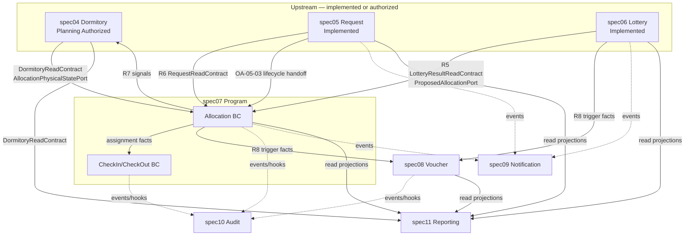

# Program Architecture Alignment Package — spec07..spec11

**Package ID:** PAA-spec07-spec11-2026-07-01-001  
**Version:** 1.0.0  
**Recorded:** 1405/04/10 | 2026/07/01  
**Phase:** Program Architecture Alignment  
**Status:** REVIEW-READY — EVIDENCE ONLY  

**Upstream PAR:** [`PAR-2026-07-01-001.md`](../par/PAR-2026-07-01-001.md) (PB-02 exit artifact)

---

## Document classification

| Property | Value |
| -------- | ----- |
| **Type** | Program Architecture Alignment bundle (analysis extraction) |
| **Authority map role** | None |
| **Grants Design Approval** | **No** |
| **Grants Implementation Authorization** | **No** |
| **Grants Architecture Freeze** | **No** |
| **Invents new architecture** | **No** — extracts existing intent only |

---

## Source inputs (frozen at alignment time)

| Document | Version |
| -------- | ------- |
| [`catalog-decisions.md`](../../docs/catalog-decisions.md) | v2.8.1 |
| [`context-map.md`](../../docs/context-map.md) | v0.4.1 |
| [`decision-index.md`](../decision-index.md) | v1.4.0 |
| [`spec-catalog.md`](../../docs/spec-catalog.md) | v1.0.8 |
| [`program-architecture-lifecycle.md`](../program-architecture-lifecycle.md) | — |
| [`dormsys-architecture.md`](../../docs/architecture/dormsys-architecture.md) | — |
| [`system-flow.md`](../../docs/architecture/system-flow.md) | — |
| [`constitution.md`](../../memory/constitution.md) | v1.3.0 |
| spec04 `plan.md` + `contracts/` | Planning Authorized |
| spec05 `spec.md` / `plan.md` | Implemented (OA-05-03 handoff deferred) |
| spec06 `plan.md` + `contracts/` | Implemented |

---

## 1. Architecture alignment bundle (per spec)

### spec07 — Allocation & Occupancy

| Field | Extracted intent |
| ----- | ---------------- |
| **Catalog name** | Allocation & Occupancy |
| **Program scope** | Single delivery program spanning three active boundaries plus upstream coordination with Dormitory (spec04) |
| **Bounded contexts** | **Allocation** (`Allocation`, `AllocationItem`, `AllocationMethod`); **CheckIn/CheckOut** (`CheckedIn`, `CheckedOut` operational transitions) — CD-015 |
| **Physical coordination** | **Dormitory** (spec04) owns physical room/bed capacity and occupancy markers; Allocation drives updates via events/ports — CD-014, R7 |
| **Governing decisions** | CD-014 (assignment vs occupancy split), CD-015 (CheckIn/CheckOut active boundary) |
| **Catalog dependencies** | spec01, spec04, spec05, spec06 |
| **Catalog status** | Planned — boundary closed; implementation not authorized |
| **Ownership — Allocation** | Assignment authority only; overlap prevention (PostgreSQL exclusion on `(person_id, daterange)` per constitution) |
| **Ownership — CheckIn/CheckOut** | Operational occupancy transitions; Operator role performs check-in/out (constitution / CLAUDE business rules) |
| **Ownership — NOT in spec07** | Physical bed markers (Dormitory); request approval state (Request); lottery rules (Lottery) |
| **Lifecycle chain (source)** | `Approved` → `WaitingForAllocation` → `Allocated` → `CheckedIn` → `CheckedOut`; terminal `AllocationFailed` — `dormsys-architecture.md`, constitution, OA-05-03 handoff from spec05 |
| **Upstream consumers** | Lottery results (`R5`), approved requests (`R6`), dormitory capacity/read (`R7` via spec04) |
| **Downstream effects** | Dormitory physical markers (`AllocationPhysicalStatePort`); Request post-approval states (OA-05-03); Employee eligibility ports; Audit; Notification; Reporting (read-only) |
| **External dormitories** | No physical bed tracking or check-in/out — voucher path via spec08 (discovery + architecture) |
| **Explicitly NOT decided (CD-014/015)** | Event contract between Allocation, Dormitory, CheckIn/CheckOut; reconciliation when states diverge |

### spec08 — External Accommodation (Voucher)

| Field | Extracted intent |
| ----- | ---------------- |
| **Bounded context** | **Voucher** |
| **Purpose** | External-stay / voucher handling when internal capacity cannot satisfy demand |
| **Governing decision** | CD-016 — Voucher owns eligibility evaluation and issuance lifecycle |
| **Catalog dependencies** | spec01, spec05, spec06 |
| **Catalog status** | Planned — boundary closed (CD-016); implementation not authorized |
| **Upstream triggers** | Lottery and/or Allocation may initiate voucher evaluation — R8; upstream supplies facts/events only |
| **Ownership** | Voucher is final authority for issuance decisions; Lottery/Allocation do not own voucher policy |
| **Explicitly NOT decided (CD-016)** | Exact input contract from Lottery/Allocation; shared eligibility logic elsewhere |

### spec09 — Notification

| Field | Extracted intent |
| ----- | ---------------- |
| **Type** | Cross-cutting delivery capability (not a business bounded context) |
| **Owned artifact** | `NotificationLog` (context-map) |
| **Purpose** | Shared delivery for email, SMS, in-app alerts |
| **Catalog dependencies** | spec01 |
| **Catalog status** | Planned — Provisional evidence basis |
| **Integration** | Downstream consumer of domain events from multiple contexts — R9 |
| **Ordering** | After spec10 in catalog implementation sequence; must not drive core domain modeling |
| **Open planning question (catalog)** | Infrastructure-only delivery vs domain-aware notification policy layer — not a closed OQ |
| **Jobs (architecture source)** | `SendNotificationJob` — async delivery pattern in `dormsys-architecture.md` |

### spec10 — Audit

| Field | Extracted intent |
| ----- | ---------------- |
| **Type** | Cross-cutting traceability capability |
| **Owned artifact** | `AuditLog` (context-map); central **`AuditService`** (constitution AP-06, DoD) |
| **Purpose** | Immutable audit trail; append-only `audit_logs`; compliance traceability |
| **Catalog dependencies** | spec01 |
| **Catalog status** | Planned — may be implemented earlier at foundation level if constitution requires |
| **Integration** | Downstream hooks/events from critical operations — R10 |
| **Binding rules** | All state transitions must emit audit entries via `AuditService`; never UPDATE/DELETE audit_logs |
| **Interim pattern (implemented modules)** | `RecordsActivity` on models until central AuditService is live |
| **Sensitive operations (architecture source)** | Allocation, state transitions, lottery execution, permission changes |
| **Open planning question (catalog)** | Pure technical logging vs per-module domain audit semantics — not a closed OQ |

### spec11 — Reporting

| Field | Extracted intent |
| ----- | ---------------- |
| **Type** | Cross-cutting read-only projection consumer |
| **Governing decision** | CD-017 — read-only cross-domain projection consumer; no write authority |
| **Purpose** | Read models, operational reports, management projections |
| **Catalog dependencies** | spec01 + implemented business specs as needed |
| **Catalog status** | Planned — boundary closed (CD-017); implementation not authorized |
| **Integration** | Downstream read-only across all contexts — R11; only context allowed cross-boundary read |
| **Read-model ownership (system-flow §5.2)** | Single-domain projection → owning domain; multi-domain projection → Reporting module |
| **Locked rule (system-flow)** | Management reports = read models only; no direct queries on transaction tables across modules |
| **Explicitly NOT decided (CD-017)** | Exact reporting model structure; projection refresh/update mechanism |

---

## 2. Dependency map

### 2.1 Program implementation order (catalog § Ordering Guidance)

```
spec01 → spec02 → spec03 → spec04 → spec05 → spec06
                                              ↓
                                         spec07 (Allocation + CheckIn/CheckOut program)
                                              ↓
                                         spec08 (Voucher)
                                              ↓
                                         spec10 (Audit) — may start earlier technically
                                              ↓
                                         spec09 (Notification)
                                              ↓
                                         spec11 (Reporting)
```

### 2.2 Cross-spec dependency graph (spec07..spec11 focus)



### 2.3 Dependency matrix

| Spec | Hard upstream (catalog) | Relationship IDs | Runtime status |
| ---- | ----------------------- | ---------------- | -------------- |
| **spec07** | spec01, spec04, spec05, spec06 | R5, R6, R7 | spec04 impl **hold**; spec05/06 **live** with stubs toward spec07 |
| **spec08** | spec01, spec05, spec06 | R8 | Upstream live; Allocation trigger deferred until spec07 |
| **spec09** | spec01 | R9 | Event sources partially live (spec05/06) |
| **spec10** | spec01 | R10 | Module scaffold exists; central service not integrated |
| **spec11** | spec01 + implemented specs | R11 | Consumers depend on spec04–spec07+ data surfaces |

### 2.4 Critical path (extracted)

**spec04 must be implemented before spec07 execution** — `DormitoryReadContract` and `AllocationPhysicalStatePort` are spec07 prerequisites (spec04 plan, PAR PB-05). spec07 boundary decisions (CD-014, CD-015) do not remove this ordering constraint.

---

## 3. Boundary mapping

### 3.1 Bounded context → spec → ownership

| Bounded context | Spec | Key aggregates / artifacts | Authority |
| --------------- | ---- | -------------------------- | --------- |
| Allocation | spec07 | Allocation, AllocationItem, AllocationMethod | CD-014 |
| CheckIn/CheckOut | spec07 | CheckIn, CheckOut (operational transitions) | CD-015 |
| Dormitory | spec04 | Dormitory, Room, Bed (physical) | CD-014 — coordinated, not owned by spec07 |
| Voucher | spec08 | Voucher | CD-016 |
| Notification | spec09 | NotificationLog | Cross-cutting capability |
| Audit | spec10 | AuditLog, AuditService | Cross-cutting + constitution AP-06 |
| Reporting | spec11 | Read models / projections (no domain write) | CD-017 |

### 3.2 spec07 program internal boundaries

| Concern | Owner module | Forbidden in peer |
| ------- | ------------ | ----------------- |
| Who is assigned to which bed/person | Allocation | CheckIn/CheckOut, Dormitory |
| Physical bed operability / occupancy markers | Dormitory (spec04) | Allocation |
| CheckedIn / CheckedOut transitions | CheckIn/CheckOut | Allocation assignment logic |
| Request approval history | Request (spec05) | Allocation (commands via port only) |

### 3.3 Cross-cutting placement

| Capability | Write authority | Read authority | Notes |
| ---------- | --------------- | -------------- | ----- |
| Notification | Notification module (delivery log) | — | Consumes upstream events |
| Audit | Audit module (append-only) | Audit consumers | Central service target |
| Reporting | **None** on upstream domains | Cross-context read-only | CD-017 + constitution |

### 3.4 Rejected boundary (do not reintroduce)

| Candidate | Status | Authority |
| --------- | ------ | --------- |
| Unified Occupancy context | Rejected | CD-014 |
| CheckIn inside Allocation only | Rejected | CD-015 |
| CheckIn inside Dormitory only | Rejected | CD-015 |
| Lottery/Allocation owns Voucher lifecycle | Rejected | CD-016 |
| Reporting owns upstream business state | Rejected | CD-017 |

---

## 4. Contract matrix and stubs list

### 4.1 Existing contracts (implemented or design-approved)

| ID | Contract / port | Direction | Producer | Consumer | Status | Source |
| -- | --------------- | --------- | -------- | -------- | ------ | ------ |
| C-01 | `RequestReadContract` | Inbound to Lottery | Request (spec05) | Lottery (spec06) | **Live** | spec06 plan |
| C-02 | `LotteryResultReadContract` | Outbound | Lottery (spec06) | Allocation (spec07) | **Stub live** | `specs/006-lottery-selection/contracts/` |
| C-03 | `ProposedAllocationPort` | Outbound | Lottery (spec06) | Allocation (spec07) | **Stub live** | `specs/006-lottery-selection/contracts/proposed-allocation-port.md` |
| C-04 | `DormitoryReadContract` | Outbound | Dormitory (spec04) | Allocation, Reporting | **Planned** — Request has null adapter copy | spec04 plan § Required Contracts |
| C-05 | `AllocationPhysicalStatePort` | Inbound to Dormitory | Allocation (spec07) | Dormitory (spec04) | **Planned** | `specs/004-accommodation-resource/contracts/allocation-physical-state-port.md` |
| C-06 | `ActiveAllocationReadPort` | Internal Employee port | Allocation (spec07) | Employee (spec03) | **Stub** — null adapter | `specs/003-employee-context/contracts/internal-read-ports.md` |

### 4.2 Contract stubs required (identified gaps — not yet authored)

These names appear in PAR PB-03 or are implied by OA-05-03 / CD-014/015/016 handoffs. **Stub definitions are required before PAR re-validation**; shapes are not invented here beyond source references.

| ID | Proposed stub name | Direction | Producer | Consumer | Trigger / evidence | Authoring owner |
| -- | ------------------ | --------- | -------- | -------- | ------------------ | --------------- |
| **C-07** | `RequestLifecycleCommandPort` | Inbound to Request | Allocation / CheckIn (spec07) | Request (spec05) | OA-05-03 post-approval states (`WaitingForAllocation`, `Allocated`, `AllocationFailed`); constitution lifecycle | spec07 + spec05 handoff |
| **C-08** | `AllocationReadContract` | Outbound | Allocation (spec07) | Employee eligibility, Reporting | `internal-read-ports.md` future adapter; overlap / active allocation queries | spec07 |
| **C-09** | `CheckInCommandPort` | Inbound to CheckIn/CheckOut | Operator UI / Allocation handoff | CheckIn/CheckOut (spec07) | CD-015 operational transitions; Operator role constraint | spec07 |
| **C-10** | `VoucherIssuancePort` | Inbound to Voucher | Lottery / Allocation (trigger) | Voucher (spec08) | CD-016 upstream facts only; exact input **not decided** | spec08 |
| **C-11** | `VoucherReadContract` | Outbound | Voucher (spec08) | Reporting (spec11) | CD-017 read-only consumer pattern | spec08 + spec11 |
| **C-12** | `AuditService` (application facade) | Inbound cross-cutting | All critical modules | Audit (spec10) | Constitution AP-06; append-only | spec10 |
| **C-13** | Domain Event Catalog v1 (module events) | Outbound events | Allocation, CheckIn, Voucher, Request | Audit, Notification, Reporting | CD-014/015 impact notes; spec04 defers event shapes to spec07 integration | program-wide stub index |

### 4.3 Contract direction rules (extracted — binding)

- Cross-module integration: **Application Service or Domain Event only** — no cross-module Eloquent (context-map constitution constraints).
- Cross-module FKs: **prohibited** — UUID value references only.
- Reporting: **read contracts only** — no write ports into domain modules (CD-017).
- Dormitory inbound signals: **`AllocationPhysicalStatePort` only** for occupancy markers (spec04 research).

---

## 5. Integration and event responsibilities (extracted)

| Integration point | Pattern | Owner emits | Owner consumes | Source |
| ----------------- | ------- | ----------- | -------------- | ------ |
| Lottery → Allocation | Port + read contract | Lottery | Allocation | R5, C-02, C-03 |
| Request → Allocation | Read contract (+ lifecycle command TBD) | Request | Allocation | R6, OA-05-03 |
| Allocation → Dormitory | Port (physical markers) | Allocation | Dormitory | R7, C-05 |
| Allocation → CheckIn/CheckOut | Assignment fact (contract TBD) | Allocation | CheckIn/CheckOut | CD-015 — **not decided** |
| Lottery/Allocation → Voucher | Trigger facts (contract TBD) | Lottery, Allocation | Voucher | R8, CD-016 — **not decided** |
| * → Audit | Hooks / domain events | All critical modules | Audit | R10, AP-06 |
| * → Notification | Domain events | Business modules | Notification | R9 |
| * → Reporting | Read contracts / projections | Source modules | Reporting | R11, system-flow §5.2 |

### Read-model ownership (system-flow §5.2)

| Projection scope | Owner |
| ---------------- | ----- |
| Single-domain events | Same domain module |
| Multi-domain management reports | Reporting (spec11) |

---

## 6. Unresolved dependencies and blockers

### 6.1 Architecture-level — not yet decided in catalog

| ID | Topic | Affects | Recorded in |
| -- | ----- | ------- | ----------- |
| UD-01 | Event contract between Allocation, Dormitory, CheckIn/CheckOut | spec07 | CD-015 What Was NOT Decided |
| UD-02 | Reconciliation when Allocation and Dormitory state diverge | spec07, spec04 | CD-014, CD-015 |
| UD-03 | Exact Voucher input contract from Lottery/Allocation | spec08 | CD-016 |
| UD-04 | Reporting model structure and refresh mechanism | spec11 | CD-017 |
| UD-05 | Notification policy layer vs pure delivery | spec09 | spec-catalog provisional OQ |
| UD-06 | Domain vs technical audit semantics per module | spec10 | spec-catalog provisional OQ |

### 6.2 Execution / artifact dependencies (PAR-aligned)

| ID | Blocker | Blocks | Exit condition |
| -- | ------- | ------ | -------------- |
| UD-07 | spec04 not implemented | spec07 runtime chain | `DormitoryReadContract` + `AllocationPhysicalStatePort` live (PAR PB-05) |
| UD-08 | Contract stubs C-07..C-13 not authored | PAR PB-03, Architecture Freeze | Minimal stub markdown under `specs/007-*` / shared contracts index |
| UD-09 | No spec07 `spec.md` skeleton | PAR PB-04 | spec07 architecture spec citing CD-015 |
| UD-10 | `RequestLifecycleCommandPort` undefined | OA-05-03 handoff | Stub contract co-owned by spec05 handoff + spec07 |
| UD-11 | Employee `ActiveAllocationReadPort` still null | Eligibility accuracy | Real adapter when spec07 `AllocationReadContract` exists |

### 6.3 Circular dependency check

**No circular module dependencies detected** in context-map R1–R12 for spec07..spec11 scope. Coupling is unidirectional: upstream facts → domain owners → downstream read/audit/notify.

---

## 7. PAR checklist (proposed — for re-validation)

| # | Check | Status | Notes |
| - | ----- | ------ | ----- |
| 1 | OQ-06..08 closed in governance mirrors | ✅ | CD-015/016/017 |
| 2 | spec07..spec11 boundaries explicit per context-map | ✅ | This package |
| 3 | Dependency order valid | ✅ | spec04 before spec07 execution |
| 4 | No circular dependencies | ✅ | §6.3 |
| 5 | Alignment package archived | ✅ | This document |
| 6 | Contracts reviewable at stub level | ⬜ | C-07..C-13 pending |
| 7 | spec07 `spec.md` exists | ⬜ | PAR PB-04 |
| 8 | spec04 upstream operational for spec07 | ⬜ | PAR PB-05 |
| 9 | Formal PAR verdict updated | ⬜ | Re-run after 6–8 |

---

## 8. Architecture freeze readiness (extracted verdict)

| Dimension | Verdict |
| --------- | ------- |
| **Boundary decisions** | Ready — OQ-01..08 closed |
| **Governance mirror sync** | Ready — per drift remediation |
| **Alignment package** | Ready — this artifact |
| **Contract direction** | Not ready — stubs C-07..C-13 absent |
| **spec07 architecture spec** | Not ready |
| **Upstream spec04 operational** | Not ready |

**Overall (alignment phase):** **Ready with conditions** — proceed to PAR re-validation after contract stubs and spec07 skeleton; Architecture Freeze remains **not permitted** until PAR issues Pass (per `program-architecture-lifecycle.md` § Architecture Freeze).

---

## 9. Change log

| Version | Date | Change |
| ------- | ---- | ------ |
| 1.0.0 | 2026-07-01 | Initial alignment extraction for spec07..spec11; satisfies PAR PB-02 |

---

**End of package.**
