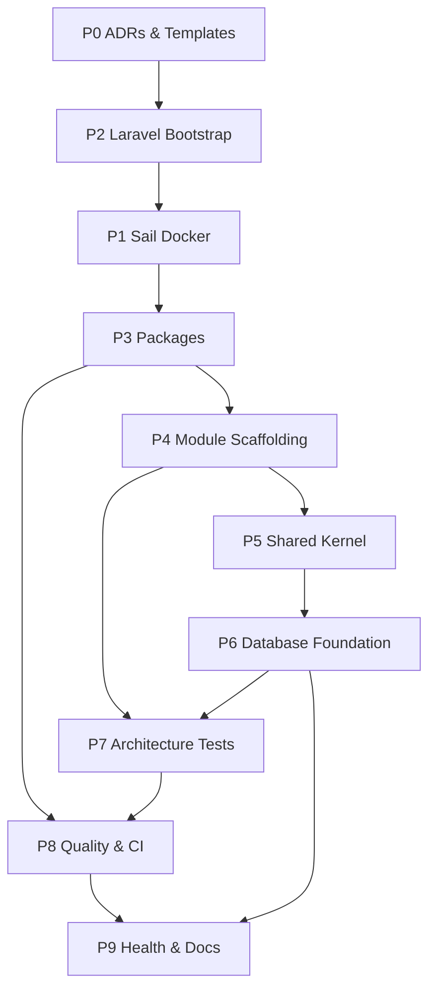

# Tasks: DormSys Technical Foundation (Spec01)

**Input**: `spec.md`, `plan.md`, `research.md`, `data-model.md`, `contracts/`, Constitution v2.0.0  
**Branch**: `001-technical-foundation`  
**Task ID Format**: `TASK-F01-XXX`  
**Module Names (final)**: Identity, Employee, Request, **Workflow**, Dormitory, Allocation, Lottery, Voucher, Notification, Audit

**Execution note**: Phases are labeled P0–P9 per plan. **P2 (Laravel bootstrap) must complete before P1 (Sail)** because Sail installs into an existing Laravel project. See Dependency Graph.

---

## Phase Summary Table

| Phase | Task Count | Total Effort | Key Deliverables |
|-------|------------|--------------|------------------|
| P0 | 4 | 6h (1M + 3S) | ADRs, migration stub, pre-commit config |
| P1 | 6 | 10h | Sail, PostgreSQL 17, Redis 7, `.env` scaffold |
| P2 | 5 | 8h | Laravel 13app, connectivity tests, routing |
| P3 | 10 | 14h | Spatie packages, Horizon, Telescope, Livewire, Jalali |
| P4 | 13 | 12h | 10 module scaffolds, providers, READMEs |
| P5 | 8 | 16h | Shared kernel contracts, VOs, events, exceptions, DTOs |
| P6 | 7 | 14h | Extensions, UUIDv7, BaseModel trait, `tbl_settings` |
| P7 | 6 | 12h | Architecture + naming + UUID + provider tests |
| P8 | 8 | 16h | Pest, PHPStan L8, Pint, pre-commit, GitHub Actions |
| P9 | 6 | 10h | `/api/health`, docs, ADR index, quickstart |
| **Total** | **73** | **~118h (~20 days @ 6h/day)** | Foundation ready for Spec02 |

---

## User Story Mapping

| Story | Priority | Phases | Independent Test |
|-------|----------|--------|------------------|
| US1 — Bootstrap & Environment | P1 | P2→P1→P3 | `sail up`, PG + Redis connectivity |
| US2 — Modular Structure | P2 | P4→P5→P6 | Module dirs + base abstractions |
| US3 — Testing Foundation | P3 | P7→P8 | `sail artisan test` all green |
| US4 — CI/CD Foundation | P4 | P8→P9 | GitHub Actions green on push |

**MVP scope**: Complete P0 → P2 → P1 → P3 → validate US1 (environment operational).

---

## P0: Pre-Implementation Decisions (Unresolved Only)

### TASK-F01-001 — ADR: Service Provider Registration Strategy

| Field | Value |
|-------|-------|
| **Effort** | S |
| **Dependencies** | — |
| **Constitutional** | AP-02, AP-03 |
| **Files** | `.specify/docs/ADR/ADR-F01-001-service-provider-registration.md` |

**Description**: Document manual explicit registration in `bootstrap/providers.php` (Research R-18). Include provider registry table and boot order.

**Acceptance Criteria**:
- [ ] ADR status = Accepted, references Constitution v2.0.0
- [ ] Documents manual registration over auto-discovery with rationale
- [ ] Lists all 10 module providers + `SharedServiceProvider`
- [ ] Includes rollback/revert guidance if provider order changes

---

### TASK-F01-002 — ADR: Module Boundary Enforcement Mechanism

| Field | Value |
|-------|-------|
| **Effort** | S |
| **Dependencies** | TASK-F01-001 |
| **Constitutional** | AP-02, AP-04 |
| **Files** | `.specify/docs/ADR/ADR-F01-002-module-boundary-enforcement.md`, `specs/001-technical-foundation/contracts/architecture-rules.md` (update) |

**Description**: Formalize Pest `arch()` rules for cross-module import prohibition and layer dependencies.

**Acceptance Criteria**:
- [ ] ADR maps each rule to ARCH-01 through ARCH-06
- [ ] Defines failure severity (CI-blocking)
- [ ] Documents allowed cross-module patterns (Application Services, Domain Events)
- [ ] `architecture-rules.md` cross-references ADR

---

### TASK-F01-003 — Migration Template Standards + Developer Stub

| Field | Value |
|-------|-------|
| **Effort** | M |
| **Dependencies** | TASK-F01-001 |
| **Constitutional** | AP-04, NFR-08 |
| **Files** | `stubs/migration.create.stub`, `.specify/docs/ADR/ADR-F01-003-migration-standards.md`, `database/migrations/foundation/` |

**Description**: Create ADR and Artisan migration stub enforcing `tbl_` prefix, UUIDv7 PK, UTC `timestamptz`, soft deletes, audit columns, rollback.

**Acceptance Criteria**:
- [ ] ADR defines `tbl_{name}` naming, snake_case columns, per-module paths
- [ ] Stub includes `uuid` PK, `created_at`/`updated_at`/`deleted_at` timestamptz
- [ ] Stub includes nullable `created_by`/`updated_by` UUID columns (no FK)
- [ ] Example foundation migration uses stub pattern
- [ ] `down()` drops table and reverses changes

---

### TASK-F01-004 — Pre-Commit Hook Configuration

| Field | Value |
|-------|-------|
| **Effort** | S |
| **Dependencies** | — (config only; wired in P8) |
| **Constitutional** | DoD §15 |
| **Files** | `.specify/docs/ADR/ADR-F01-004-pre-commit-hooks.md`, `scripts/git-hooks/pre-commit` |

**Description**: ADR + hook script template for Pint (staged) and PHPStan (changed PHP files).

**Acceptance Criteria**:
- [ ] ADR documents local-only enforcement; CI remains source of truth
- [ ] Hook script is POSIX-compatible and executable
- [ ] Documents install via `composer run hooks:install` (script added in P8)
- [ ] Hook skips gracefully when tools unavailable

---

## P2: Laravel 13Bootstrap *(execute before P1)*

- [x] **TASK-F01-005** | Effort: M | Deps: P0 complete | AP-01  
  **Title**: Create Laravel 13 project in repository root  
  **Files**: `composer.json`, `artisan`, `bootstrap/app.php`, `public/index.php`  
  **AC**: `php artisan --version` shows Laravel 13.x; `APP_NAME=DormSys`; `.gitignore` excludes `.env`, `vendor/`, `node_modules/`  
  **Note**: Installed Laravel 13 skeleton (latest `laravel/laravel`); pin to ^12.0 in follow-up if required.

- [ ] **TASK-F01-006** | Effort: S | Deps: F01-005 | AP-01, FR-020  
  **Title**: Remove default boilerplate tests and welcome noise  
  **Files**: `tests/Feature/ExampleTest.php` (remove/replace), `tests/Unit/ExampleTest.php` (remove/replace)  
  **AC**: No stock Example tests; `tests/` has Pest-ready structure

- [x] **TASK-F01-007** | Effort: S | Deps: F01-005 | FR-016, FR-019, NFR-07  
  **Title**: Scaffold `.env.example` foundation variables  
  **Files**: `.env.example`  
  **AC**: Contains `APP_TIMEZONE=UTC`, `APP_LOCALE=fa`, `DB_CONNECTION=pgsql`, `CACHE_STORE=redis`, `QUEUE_CONNECTION=redis`, `SESSION_DRIVER=redis`; all keys commented where non-obvious

- [ ] **TASK-F01-008** | Effort: S | Deps: F01-007 | FR-018, NFR-05  
  **Title**: Configure structured JSON logging for production  
  **Files**: `config/logging.php`  
  **AC**: Production channel uses JSON formatter; local uses stack/single; context keys documented in config comments

- [ ] **TASK-F01-009** | Effort: S | Deps: F01-005 | AP-01  
  **Title**: Verify basic web routing  
  **Files**: `routes/web.php`, `routes/api.php`  
  **AC**: `php artisan route:list` succeeds; default `/up` route available (Laravel 12)

---

## P1: Docker Environment (Laravel Sail)

- [x] **TASK-F01-010** | Effort: M | Deps: F01-005 | FR-011, R-02  
  **Title**: Install Laravel Sail with PostgreSQL 17 + Redis 7  
  **Files**: `compose.yaml`, `docker/`, `phpunit.xml`  
  **AC**: `compose.yaml` defines `laravel.test`, `pgsql` (postgres:17), `redis` (redis:7); `sail up -d` succeeds

- [x] **TASK-F01-011** | Effort: S | Deps: F01-010 | FR-011  
  **Title**: Configure Sail `.env` for container hostnames  
  **Files**: `.env.example`, `.env` (local)  
  **AC**: `DB_HOST=pgsql`, `REDIS_HOST=redis`; passwords match Sail defaults

- [x] **TASK-F01-012** | Effort: S | Deps: F01-010 | —  
  **Title**: Document Sail shell alias setup  
  **Files**: `docs/environment.md`  
  **AC**: README documents `alias sail='[ -f sail ] && sh sail || sh vendor/bin/sail'` for bash/zsh/PowerShell equivalent

- [x] **TASK-F01-013** | Effort: S | Deps: F01-011 | FR-002, US1  
  **Title**: PostgreSQL connectivity verification test  
  **Files**: `tests/Feature/Foundation/DatabaseConnectionTest.php`  
  **AC**: Test asserts `DB::connection()->getPdo()` succeeds via Sail PostgreSQL

- [x] **TASK-F01-014** | Effort: S | Deps: F01-011 | FR-003, US1  
  **Title**: Redis connectivity verification test  
  **Files**: `tests/Feature/Foundation/RedisConnectionTest.php`  
  **AC**: `Cache::put/get` round-trip passes against Redis

- [x] **TASK-F01-015** | Effort: S | Deps: F01-013, F01-014 | US1  
  **Title**: Application boot smoke test  
  **Files**: `tests/Feature/Foundation/ApplicationBootTest.php`, `tests/Feature/Foundation/QueueConnectionTest.php`  
  **AC**: `php artisan about` and HTTP `/up` return success in test environment  
  **Note**: Live `sail up` verification pending — Docker Desktop was not running during implementation.

---

## P3: Constitution-Mandated Packages

- [ ] **TASK-F01-016** | Effort: S | Deps: F01-010 | FR-010, AP-05  
  **Title**: Install `spatie/laravel-model-states`  
  **Files**: `composer.json`, `config/model-states.php`  
  **AC**: Package installed; config published; no business states defined

- [ ] **TASK-F01-017** | Effort: S | Deps: F01-010 | FR-010, AP-06  
  **Title**: Install `spatie/laravel-activitylog`  
  **Files**: `composer.json`, `database/migrations/*_create_activity_log_table.php`  
  **AC**: Migration published; migrates cleanly; no seeders

- [ ] **TASK-F01-018** | Effort: S | Deps: F01-010 | FR-010, NFR-S01  
  **Title**: Install `spatie/laravel-permission`  
  **Files**: `composer.json`, `config/permission.php`, migrations  
  **AC**: Migration published; no roles seeded; config `teams` disabled unless ADR says otherwise

- [ ] **TASK-F01-019** | Effort: M | Deps: F01-010 | AP-08  
  **Title**: Install Laravel Horizon (no jobs)  
  **Files**: `composer.json`, `config/horizon.php`, `app/Providers/HorizonServiceProvider.php`  
  **AC**: Horizon dashboard gated to local; Redis connection configured; no job classes

- [ ] **TASK-F01-020** | Effort: S | Deps: F01-010 | NFR-03  
  **Title**: Install Laravel Telescope (local only)  
  **Files**: `composer.json`, `config/telescope.php`, `app/Providers/TelescopeServiceProvider.php`  
  **AC**: Registered only when `APP_ENV=local`; disabled in production config

- [ ] **TASK-F01-021** | Effort: S | Deps: F01-010 | FR-013, UUIDv7  
  **Title**: Install `ramsey/uuid` for UUIDv7 generation  
  **Files**: `composer.json`, `app/Shared/Infrastructure/Uuid/UuidGenerator.php`  
  **AC**: `Uuid::uuid7()` wrapper returns string; unit test validates UUIDv7 format

- [ ] **TASK-F01-022** | Effort: S | Deps: F01-010 | FR-010, NFR-07  
  **Title**: Install `morilog/jalali`  
  **Files**: `composer.json`, `config/app.php` (alias optional)  
  **AC**: Package autoloads; sample conversion in unit test passes

- [ ] **TASK-F01-023** | Effort: M | Deps: F01-010 | FR-007, AP-07  
  **Title**: Install Livewire 3 (minimal layout stub)  
  **Files**: `composer.json`, `resources/views/layouts/app.blade.php`, `config/livewire.php`  
  **AC**: Livewire service provider registered; no business components

- [ ] **TASK-F01-024** | Effort: M | Deps: F01-023 | FR-008, NFR-07  
  **Title**: Install Tailwind CSS 4 with RTL support  
  **Files**: `package.json`, `vite.config.js`, `resources/css/app.css`, `tailwind.config.js`  
  **AC**: `npm run build` succeeds; RTL plugin configured; `dir="rtl"` on root layout

- [ ] **TASK-F01-025** | Effort: S | Deps: F01-016–024 | US1  
  **Title**: Run package migrations via Sail  
  **Files**: — (command)  
  **AC**: `sail artisan migrate` succeeds with all published package migrations

---

## P4: Module Scaffolding

- [ ] **TASK-F01-026** | Effort: M | Deps: F01-005 | AP-02, FR-004–FR-005  
  **Title**: Create `ModuleServiceProvider` base class  
  **Files**: `app/Shared/Infrastructure/ModuleServiceProvider.php`  
  **AC**: Abstract `moduleName()` method; `boot()` loads migrations from module path; PHPStan clean

- [ ] **TASK-F01-027** | Effort: S | Deps: F01-026 | AP-02  
  **Title**: Create `SharedServiceProvider`  
  **Files**: `app/Shared/Infrastructure/SharedServiceProvider.php`, `bootstrap/providers.php`  
  **AC**: Registered in `bootstrap/providers.php`; binds shared kernel services

- [ ] **TASK-F01-028** [P] | Effort: S | Deps: F01-026 | AP-02, FR-004 | **Identity module scaffold**  
  **Files**: `app/Modules/Identity/{Domain,Application,Infrastructure,Presentation}/`, `app/Modules/Identity/IdentityServiceProvider.php`, `app/Modules/Identity/README.md`

- [ ] **TASK-F01-029** [P] | Effort: S | Deps: F01-026 | AP-02 | **Employee module scaffold**  
  **Files**: `app/Modules/Employee/...`, `EmployeeServiceProvider.php`, `README.md`

- [ ] **TASK-F01-030** [P] | Effort: S | Deps: F01-026 | AP-02 | **Request module scaffold**  
  **Files**: `app/Modules/Request/...`, `RequestServiceProvider.php`, `README.md`

- [ ] **TASK-F01-031** [P] | Effort: S | Deps: F01-026 | AP-02, BR-08 | **Workflow module scaffold**  
  **Files**: `app/Modules/Workflow/...`, `WorkflowServiceProvider.php`, `README.md`  
  **AC**: README documents four-stage approval ownership (BR-08); not named `Approval`

- [ ] **TASK-F01-032** [P] | Effort: S | Deps: F01-026 | AP-02 | **Dormitory module scaffold**  
  **Files**: `app/Modules/Dormitory/...`, `DormitoryServiceProvider.php`, `README.md`

- [ ] **TASK-F01-033** [P] | Effort: S | Deps: F01-026 | AP-02, BR-02 | **Allocation module scaffold**  
  **Files**: `app/Modules/Allocation/...`, `AllocationServiceProvider.php`, `README.md`

- [ ] **TASK-F01-034** [P] | Effort: S | Deps: F01-026 | AP-02, BR-06 | **Lottery module scaffold**  
  **Files**: `app/Modules/Lottery/...`, `LotteryServiceProvider.php`, `README.md`

- [ ] **TASK-F01-035** [P] | Effort: S | Deps: F01-026 | AP-02, BR-07 | **Voucher module scaffold**  
  **Files**: `app/Modules/Voucher/...`, `VoucherServiceProvider.php`, `README.md`

- [ ] **TASK-F01-036** [P] | Effort: S | Deps: F01-026 | AP-02 | **Notification module scaffold**  
  **Files**: `app/Modules/Notification/...`, `NotificationServiceProvider.php`, `README.md`

- [ ] **TASK-F01-037** [P] | Effort: S | Deps: F01-026 | AP-02, AP-06 | **Audit module scaffold**  
  **Files**: `app/Modules/Audit/...`, `AuditServiceProvider.php`, `README.md`

- [ ] **TASK-F01-038** | Effort: S | Deps: F01-028–037 | FR-004, TASK-F01-001  
  **Title**: Register all module providers in `bootstrap/providers.php`  
  **Files**: `bootstrap/providers.php`  
  **AC**: All 10 providers listed in documented boot order; `php artisan about` boots without error

---

**P4 scaffold AC (applies to F01-028–037)**:
- [ ] Four layer subdirectories exist: `Domain/`, `Application/`, `Infrastructure/`, `Presentation/`
- [ ] Each `README.md` states owned entities (future), invariants, and constitutional refs
- [ ] `database/migrations/{module}/.gitkeep` exists for migration ownership

---

## P5: Shared Kernel

### P5.1 — Repository and Service Contracts

- [ ] **TASK-F01-039** | Effort: M | Deps: F01-038 | AP-03, FR-012  
  **Title**: Implement `BaseEntity`, `BaseValueObject`, `BaseDomainEvent`  
  **Files**: `app/Shared/Domain/BaseEntity.php`, `BaseValueObject.php`, `BaseDomainEvent.php`  
  **AC**: Pure PHP; no Illuminate imports; UUIDv7 id on entity construction; PHPStan L8 clean

- [ ] **TASK-F01-040** | Effort: S | Deps: F01-039 | AP-03, FR-012  
  **Title**: Implement `BaseRepository` interface  
  **Files**: `app/Shared/Domain/Contracts/BaseRepository.php`  
  **AC**: Matches `contracts/repository-interface.md`; `save`, `findById`, `delete` defined

### P5.2 — Value Objects

- [ ] **TASK-F01-041** [P] | Effort: M | Deps: F01-039 | AP-03, NFR-S01  
  **Title**: Implement `Email` value object  
  **Files**: `app/Shared/Domain/ValueObjects/Email.php`  
  **AC**: Validates RFC-like email format; immutable; `equals()` implemented; throws `ValidationException` on invalid

- [ ] **TASK-F01-042** [P] | Effort: M | Deps: F01-039 | AP-03  
  **Title**: Implement `PhoneNumber` value object  
  **Files**: `app/Shared/Domain/ValueObjects/PhoneNumber.php`  
  **AC**: Validates Iranian mobile format (09xxxxxxxxx); immutable; `toString()` normalized

- [ ] **TASK-F01-043** [P] | Effort: M | Deps: F01-039 | AP-03  
  **Title**: Implement `NationalCode` value object  
  **Files**: `app/Shared/Domain/ValueObjects/NationalCode.php`  
  **AC**: Validates 10-digit Iranian national code with checksum; immutable

### P5.3 — Domain Events

- [ ] **TASK-F01-044** | Effort: M | Deps: F01-039 | AP-03  
  **Title**: Domain event dispatcher contract + sample event  
  **Files**: `app/Shared/Application/Contracts/DomainEventDispatcher.php`, `app/Shared/Infrastructure/Events/LaravelDomainEventDispatcher.php`, `app/Shared/Domain/Events/SampleFoundationEvent.php`  
  **AC**: Dispatcher invoked only from Application layer; sample event extends `BaseDomainEvent`

### P5.4 — Base Exceptions

- [ ] **TASK-F01-045** | Effort: S | Deps: F01-039 | AP-03  
  **Title**: Implement `DomainException` and `ValidationException`  
  **Files**: `app/Shared/Domain/Exceptions/DomainException.php`, `ValidationException.php`  
  **AC**: Extend PHP base exceptions; used by value object tests

### P5.5 — Base DTOs

- [ ] **TASK-F01-046** | Effort: M | Deps: F01-039 | AP-03  
  **Title**: Implement `BaseDTO` readonly transfer object  
  **Files**: `app/Shared/Application/DTOs/BaseDTO.php`  
  **AC**: `fromArray()` / `toArray()`; readonly properties; sample `PingResponseDTO` for health endpoint

---

## P6: Database Foundation

- [ ] **TASK-F01-047** | Effort: S | Deps: F01-010, F01-003 | FR-015, R-06  
  **Title**: Foundation migration — enable `uuid-ossp` and `pgcrypto`  
  **Files**: `database/migrations/foundation/0001_enable_postgresql_extensions.php`  
  **AC**: `up()` creates extensions; `down()` drops them; descriptive failure if PG lacks extension

- [ ] **TASK-F01-048** | Effort: M | Deps: F01-021, F01-047 | FR-013, UUIDv7  
  **Title**: Implement `HasUuidV7PrimaryKey` trait  
  **Files**: `app/Shared/Infrastructure/Persistence/Concerns/HasUuidV7PrimaryKey.php`  
  **AC**: Auto-assigns UUIDv7 on `creating`; `$incrementing = false`; `$keyType = 'string'`

- [x] **TASK-F01-049** | Effort: M | Deps: F01-048 | NFR-08, FR-019  
  **Title**: Implement `BaseModel` abstract Eloquent model  
  **Files**: `app/Shared/Infrastructure/Persistence/BaseModel.php`  
  **AC**: Uses `HasUuidV7PrimaryKey`; `SoftDeletes`; `$casts` for UTC datetimes; `created_by`/`updated_by` UUID nullable

- [ ] **TASK-F01-050** | Effort: S | Deps: F01-049 | FR-019  
  **Title**: Enforce UTC timezone in database config  
  **Files**: `config/database.php`, `config/app.php`  
  **AC**: `APP_TIMEZONE=UTC`; PostgreSQL session timezone UTC; test asserts config

- [ ] **TASK-F01-051** | Effort: M | Deps: F01-003, F01-047 | AP-04, Rule 4 (ADR)  
  **Title**: Create `tbl_settings` foundation migration  
  **Files**: `database/migrations/foundation/0002_create_tbl_settings_table.php`  
  **AC**: Table `tbl_settings`; UUIDv7 PK; `key` unique string; `value` jsonb; audit columns; `tbl_` prefix

- [x] **TASK-F01-052** | Effort: S | Deps: F01-038 | R-17  
  **Title**: Wire per-module migration paths in service providers  
  **Files**: `app/Modules/*/…ServiceProvider.php`  
  **AC**: Each provider calls `loadMigrationsFrom()` for `database/migrations/{module}/`

- [ ] **TASK-F01-053** | Effort: S | Deps: F01-039, F01-049 | US2  
  **Title**: Sample domain entity extending `BaseEntity`  
  **Files**: `app/Modules/Identity/Domain/Entities/SampleEntity.php`, `tests/Unit/Shared/BaseAbstractionsTest.php`  
  **AC**: Sample entity compiles; unit test proves extension without Eloquent

---

## P7: Architecture Tests (Constitutional Enforcement)

- [x] **TASK-F01-054** | Effort: M | Deps: F01-038, F01-039, P8 Pest setup | AP-03, TASK-F01-002  
  **Title**: Layer dependency architecture tests  
  **Files**: `tests/Architecture/LayerDependencyTest.php`  
  **AC**: Domain cannot use Infrastructure/Presentation/Eloquent; ARCH-01–04 enforced

- [x] **TASK-F01-055** | Effort: M | Deps: F01-038 | AP-02, AP-04  
  **Title**: Module boundary architecture tests  
  **Files**: `tests/Architecture/ModuleBoundaryTest.php`  
  **AC**: No cross-module Infrastructure imports; Shared Domain cannot import Modules

- [ ] **TASK-F01-056** | Effort: S | Deps: F01-051 | AP-04  
  **Title**: Table naming convention test (`tbl_` prefix)  
  **Files**: `tests/Architecture/TableNamingConventionTest.php`  
  **AC**: Scans foundation migrations; fails if application tables lack `tbl_` prefix (excludes Spatie package tables)

- [ ] **TASK-F01-057** | Effort: S | Deps: F01-049 | FR-013  
  **Title**: UUID primary key convention test  
  **Files**: `tests/Architecture/UuidPrimaryKeyTest.php`  
  **AC**: All classes extending `BaseModel` use non-incrementing string keys

- [x] **TASK-F01-058** | Effort: S | Deps: F01-038 | AP-02, TASK-F01-001  
  **Title**: Service provider registration test  
  **Files**: `tests/Architecture/ServiceProviderRegistrationTest.php`  
  **AC**: Asserts all 10 module providers registered and bootable

- [ ] **TASK-F01-059** | Effort: S | Deps: F01-028–037 | US2, FR-004  
  **Title**: Module structure validation test  
  **Files**: `tests/Feature/Foundation/ModuleStructureTest.php`  
  **AC**: 10 modules × 4 layers; shared kernel dirs exist (SC-005)

---

## P8: Code Quality & CI

- [x] **TASK-F01-060** | Effort: M | Deps: F01-005 | FR-009, NFR-04  
  **Title**: Configure Pest 3 with Laravel plugin  
  **Files**: `tests/Pest.php`, `pest.php`, `composer.json`  
  **AC**: `sail artisan test` runs Pest; `tests/Architecture/` and `tests/Feature/Foundation/` discovered

- [x] **TASK-F01-061** | Effort: M | Deps: F01-060 | NFR-04  
  **Title**: Install `pest-plugin-arch` for architecture tests  
  **Files**: `composer.json`, `tests/Pest.php`  
  **AC**: `arch()` expectations available; F01-054/055 use plugin

- [x] **TASK-F01-062** | Effort: M | Deps: F01-005 | DoD §15  
  **Title**: Configure PHPStan Level 8 + Larastan  
  **Files**: `phpstan.neon`, `composer.json`  
  **AC**: `composer run phpstan` passes at level 8 on foundation code

- [x] **TASK-F01-063** | Effort: S | Deps: F01-005 | DoD §15  
  **Title**: Configure Laravel Pint  
  **Files**: `pint.json` (optional overrides), `composer.json` scripts  
  **AC**: `composer run pint -- --test` passes

- [ ] **TASK-F01-064** | Effort: S | Deps: TASK-F01-004, F01-063, F01-062 | DoD §15  
  **Title**: Wire pre-commit hook install script  
  **Files**: `scripts/git-hooks/pre-commit`, `composer.json` (`hooks:install`)  
  **AC**: `composer run hooks:install` copies hook to `.git/hooks/pre-commit`

- [x] **TASK-F01-065** | Effort: M | Deps: F01-060–063 | FR-014, US4  
  **Title**: GitHub Actions CI workflow  
  **Files**: `.github/workflows/ci.yml`  
  **AC**: Matches `contracts/ci-pipeline.md`; PG 17 + Redis services; pint, phpstan, test steps

- [ ] **TASK-F01-066** | Effort: M | Deps: F01-065 | US4, NFR-04  
  **Title**: CI coverage reporting  
  **Files**: `phpunit.xml`, `.github/workflows/ci.yml`  
  **AC**: Pest coverage generated in CI; artifact uploaded (no threshold gate in Spec01)

- [ ] **TASK-F01-067** | Effort: S | Deps: F01-060 | US3  
  **Title**: Sample module unit test in Identity  
  **Files**: `tests/Unit/Modules/Identity/SampleEntityTest.php`  
  **AC**: Runs in suite; demonstrates module test mirror structure

---

## P9: Health Check & Documentation

- [x] **TASK-F01-068** | Effort: M | Deps: F01-013, F01-014, F01-046 | NFR-05, R-19  
  **Title**: Implement `GET /api/health` JSON endpoint  
  **Files**: `routes/api.php`, `app/Http/Controllers/HealthController.php`  
  **AC**: Returns 200 when PG+Redis ok; 503 when degraded; JSON per `contracts/health-endpoints.md`

- [ ] **TASK-F01-069** | Effort: S | Deps: F01-007 | FR-016  
  **Title**: Finalize `.env.example` with commented documentation  
  **Files**: `.env.example`  
  **AC**: Every foundation variable documented inline; matches Sail + CI env

- [ ] **TASK-F01-070** | Effort: M | Deps: all phases | FR-017  
  **Title**: Complete `README.md` setup guide  
  **Files**: `README.md`  
  **AC**: Clone → composer → sail up → migrate → test flow; links to quickstart.md

- [ ] **TASK-F01-071** | Effort: S | Deps: P0 ADRs | —  
  **Title**: ADR index document  
  **Files**: `.specify/docs/ADR/README.md`  
  **AC**: Links to ADR-F01-001–004 and `dormsys-architecture-technical-stack-v1.md`

- [ ] **TASK-F01-072** | Effort: M | Deps: F01-038 | AP-02, AP-03  
  **Title**: Architecture diagram (modules + layers)  
  **Files**: `.specify/docs/architecture/module-monolith-diagram.md`  
  **AC**: Mermaid or ASCII diagram of 10 modules, 4 layers, shared kernel, infrastructure

- [ ] **TASK-F01-073** | Effort: S | Deps: F01-070 | US1–US4  
  **Title**: Run quickstart.md validation checklist  
  **Files**: `specs/001-technical-foundation/quickstart.md`  
  **AC**: All quickstart checklist items pass; SC-001 through SC-010 satisfied

---

## Dependency Graph

**Critical path**: P0 → P2 → P1 → P3 → P4 → P5 → P6 → P7 → P8 → P9 (~118h)

**Parallel opportunities**:
- F01-028–037 (module scaffolds) after F01-026
- F01-041–043 (value objects) after F01-039
- F01-054–055 can start once P4+P5 complete (before full P6 if BaseModel mocked)

---

## Estimated Timeline

| Week | Phases | Hours |
|------|--------|-------|
| 1 | P0, P2, P1, P3 (partial) | 30h |
| 2 | P3 (finish), P4, P5 (partial) | 30h |
| 3 | P5 (finish), P6, P7 | 28h |
| 4 | P8, P9 | 30h |

**Total**: ~118h ≈ **20 working days** at 6h/day (single developer).

---

## Constitutional Compliance Matrix

| Principle | Enforced By Tasks |
|-----------|-------------------|
| AP-01 Technology Stack | F01-005, F01-010, F01-016–025 |
| AP-02 Modular Monolith | F01-026–038, F01-058, F01-059, F01-072 |
| AP-03 Clean Architecture | F01-039–046, F01-054, F01-055 |
| AP-04 DB Module Ownership | F01-003, F01-051–052, F01-055, F01-056 |
| AP-05 State Machines | F01-016 |
| AP-06 Audit | F01-017, F01-037 |
| AP-07 Server-First | F01-023, F01-024 |
| AP-08 Queue Processing | F01-019, F01-010 |
| AP-09 Caching | F01-014, F01-010 |
| NFR-04 Maintainability | F01-060–067 |
| NFR-05 Observability | F01-008, F01-068 |
| NFR-07 Localization | F01-007, F01-022, F01-024 |
| NFR-08 Data Integrity | F01-047–051 |
| BR-02 Allocation | F01-033 (scaffold README only) |
| BR-06 Lottery | F01-034 (scaffold README only) |
| BR-07 External Dormitory | F01-035 (scaffold README only) |
| BR-08 Approval Workflow | F01-031 (scaffold README only) |
| DoD §15 Quality Gates | F01-062–066 |

---

## Risk Items

| Risk | Severity | Mitigation Task |
|------|----------|-----------------|
| P1 before P2 ordering confuses developers | Medium | README + this tasks.md execution note |
| UUIDv7 not native in PostgreSQL gen_random_uuid | Low | Application-side generation via `ramsey/uuid` (F01-021, F01-048) |
| Spatie tables lack `tbl_` prefix | Low | F01-056 excludes vendor/package tables; ADR-F01-003 documents exception |
| `pest-plugin-arch` API changes | Low | Pin versions in composer.lock (F01-061) |
| Spec01 spec says `Approval` module name | Medium | User directive: use `Workflow`; update spec in separate clarify pass |
| Telescope/Horizon in production | Medium | F01-019, F01-020 gate to local/staging only |
| No authentication in Spec01 | Info | Fortify/Sanctum deferred to Spec02 per user directive |

---

## Checklist Format Index

All 73 tasks use IDs `TASK-F01-005` through `TASK-F01-073` (P0 uses 001–004). Checkbox items embedded in Acceptance Criteria per task. Mark `- [ ]` complete as implementation proceeds.

**Suggested first sprint**: TASK-F01-001 → F01-004 → F01-005 → F01-007 → F01-010 → F01-013 → F01-014 → F01-015 (MVP / US1).
